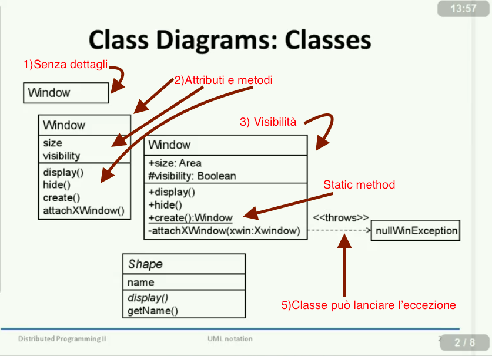
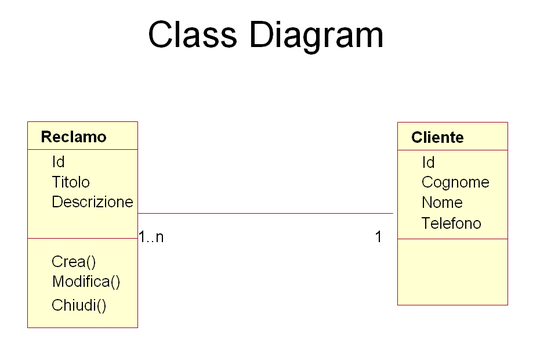
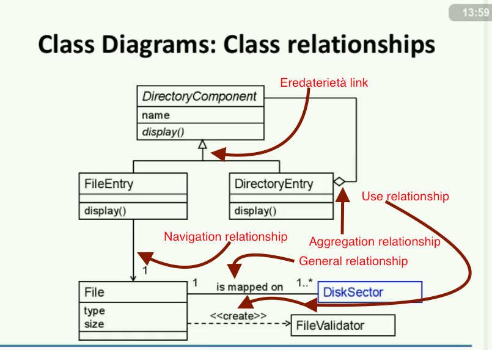
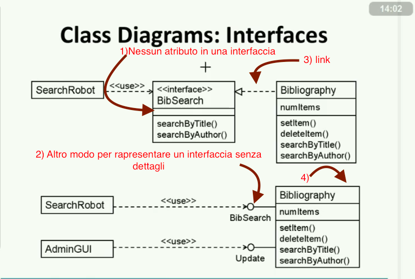
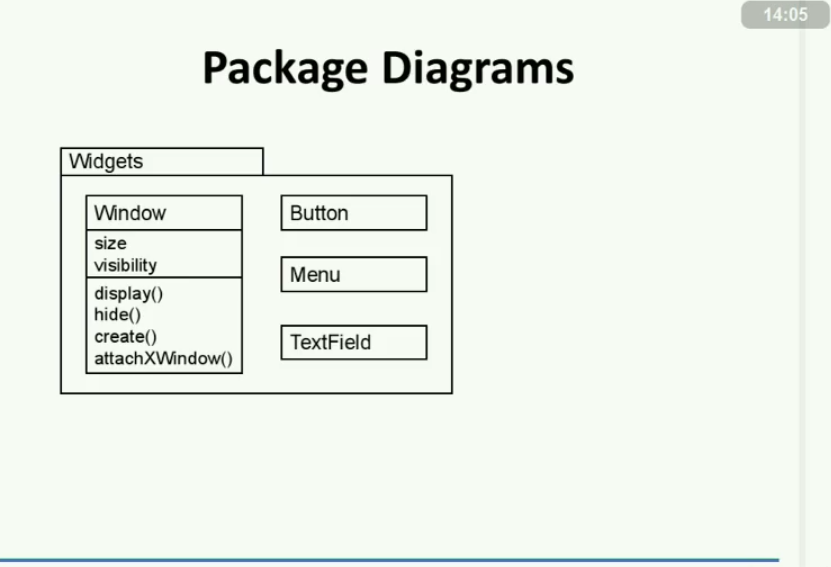
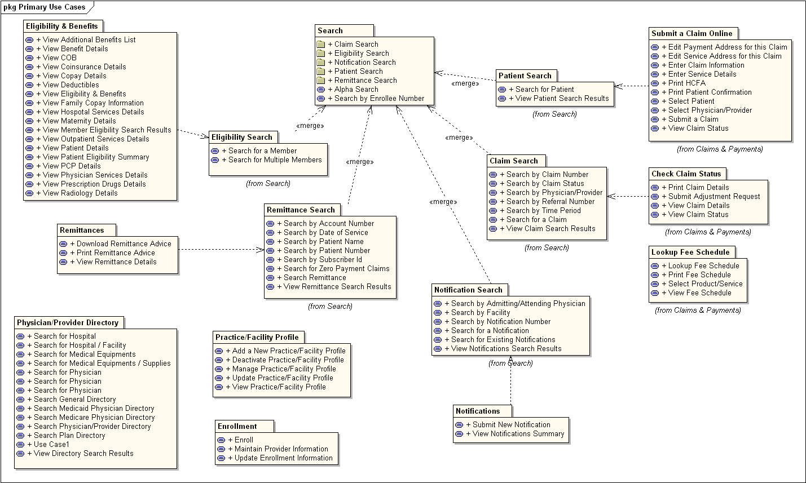
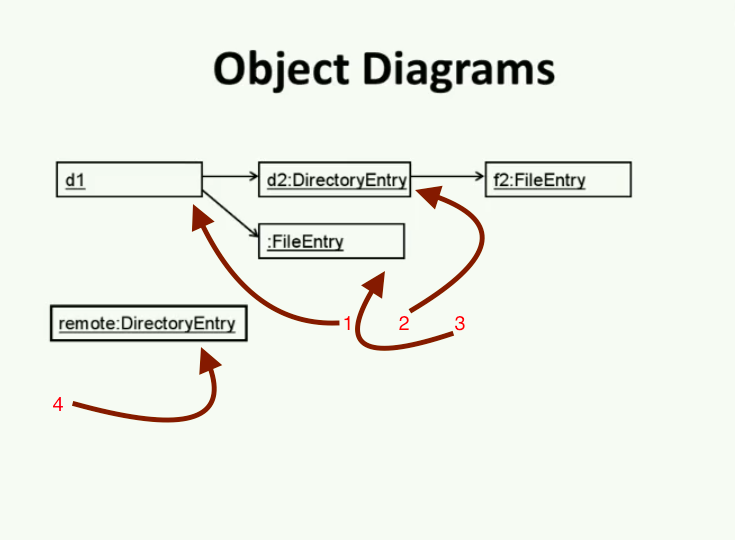
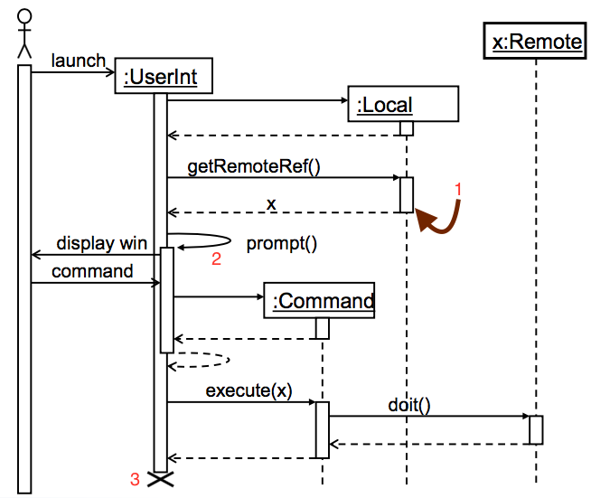
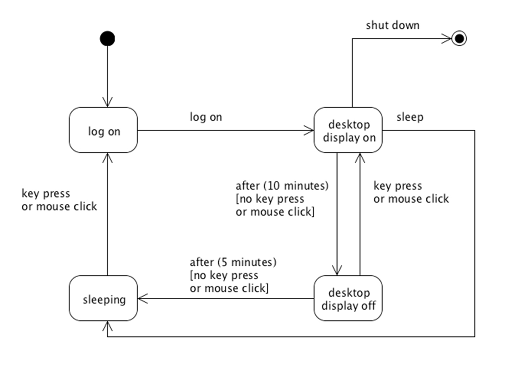
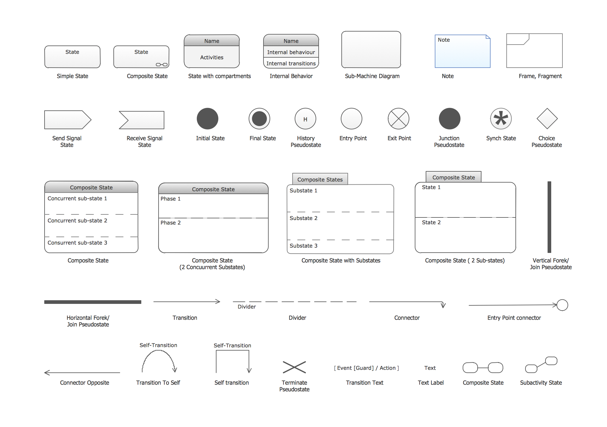

# 01 - A brief recall of UML NOTATION

## Lesson outline

1. Class Diagrams
2. Package Diagrams
3. Object Diagrams
4. Sequence Diagrams

Questa parte è solo un richiamo per avere la stessa **base**/**linguaggio**/**idea** del professore sull'UML questo per evitare incomprensioni in futuro. 

## Richiami su UML

In ingegneria del software, **UML** (unified modeling language, *"linguaggio di modellizzazione unificato"*) è un linguaggio di modellizzazione e specifica basato sul paradigma orientato agli oggetti. Il nucleo del linguaggio fu definito nel 1996 da Grady Booch, Jim Rumbaugh e Ivar Jacobson (detti *"i tre amigos"*) sotto l'egida dell'*Object Management Group*, consorzio che tuttora gestisce lo **standard UML**. Il linguaggio nacque con l'intento di unificare approcci precedenti (dovuti ai tre padri di UML e altri), raccogliendo le migliori prassi nel settore e definendo così uno standard industriale unificato.

L'UML svolge un'importantissima funzione di "**lingua franca**" nella comunità della progettazione e programmazione a oggetti. Gran parte della letteratura di settore usa UML per descrivere soluzioni analitiche e progettuali in modo *sintetico* e *comprensibile* a un vasto pubblico.

L'ultima versione del linguaggio, la **2.0**, è stata consolidata nel 2004 e ufficializzata da OMG nel 2005. UML 2.0 riorganizza molti degli elementi della versione precedente (1.5) in un quadro di riferimento ampliato e introduce molti nuovi strumenti, inclusi alcuni nuovi tipi di diagrammi. Sebbene OMG indichi UML 2.0 come la versione "corrente" del linguaggio, la transizione è di fatto ancora in corso; le stesse specifiche pubblicate da OMG sono ancora non completamente aggiornate e il supporto dei tool a UML 2.0 è, nella maggior parte dei casi, appena abbozzato.

## Class Diagrams

I **diagrammi delle classi** (*class diagram*) sono uno dei tipi di diagrammi che possono comparire in un modello UML. In termini generali, consentono di descrivere tipi di entità, con le loro caratteristiche e le eventuali relazioni fra questi tipi. Gli strumenti concettuali utilizzati sono il concetto di classe del paradigma *object-oriented* e altri correlati (per esempio la **generalizzazione**, che è una relazione concettuale assimilabile al meccanismo object-oriented dell'**ereditarietà**).

##### Usi dei diagrammi delle classi

Uno degli assunti fondamentali del paradigma a oggetti è che il concetto di classe, e concetti correlati come l'ereditarietà o il polimorfismo, si prestino a rappresentare in modo diretto e intuitivo la realtà, in qualsiasi ambito (per usare le parole di Grady Booch, "un oggetto è qualsiasi cosa a cui si possa pensare"). I diagrammi delle classi UML sono basati su versioni astratte di tali concetti, e possono essere utilizzati per descrivere sostanzialmente qualsiasi contesto a qualsiasi livello di astrazione (enfatizzandone, però, solo alcuni aspetti). Di conseguenza, UML prevede un loro impiego a livello di analisi e in particolare analisi del dominio (ovvero la descrizione del contesto in cui un sistema software deve operare), ma anche a livello di progettazione (nella descrizione della struttura interna del sistema, dei suoi componenti e delle loro relazioni).

#### Concetti principali

##### Classe

L'elemento di modello principale dei diagrammi delle classi è la classe. Una classe rappresenta una categoria di entità (istanze), nel caso particolare dette oggetti; il nome della classe indica la categoria di entità descritta dalla classe. Ogni classe è corredata da un insieme di attributi (che descrivono le caratteristiche o lo stato degli oggetti della classe) e operazioni (che descrivono il comportamento della classe). Il simbolo grafico che rappresenta le classi UML è un rettangolo suddiviso in tre scomparti, rispettivamente dedicati al nome della classe, agli attributi e alle operazioni.

Si possono rappresenatare le classi in vario modo:

1. Una classe senza altri dettagli.
2. Oppure con attributi e metodi.
3. Oppure dando ancora più dettagli come public, protect ecc… Con anche dei "static metodi".
4. Ci possono anche essere metodi astratti.
5. Se un metodo ha un eccezione si può usare una "throws relazione" in cui si punta alla classe a cui è collegata l'eccezione.

Si può avere  una classe senza altri dettagli. 

##### Relazione

Due classi possono essere legate da relazioni che rappresentano i legami (link) che possono sussistere fra gli oggetti delle classi associate. Tali Relazioni possono essere corredate da un insieme di informazioni aggiuntive, per esempio, il ruolo svolto da ogni classe o la molteplicità della relazione (il numero di oggetti delle due classi che possono essere coinvolti in un link). Esistono diversi tipi di relazione (associazione, aggregazione, composizione, dipendenza, generalizzazione, realizzazione), e ogni tipo viene rappresentato mediante una particolare linea orientata da una freccia che connette le due classi coinvolte.

##### Associazione

Due classi possono essere legate da relazione di associazione, che indica che gli oggetti delle due classi condividono una relazione statica.

##### Dipendenza

Due classi possono essere legate da una relazione di dipendenza, che indica che la definizione di una delle due fa riferimento alla definizione dell'altra.

##### Generalizzazione

Due classi possono essere legate da una relazione di generalizzazione, che indica che una delle due classi (detta superclasse) si può considerare una generalizzazione dell'altra (detta sottoclasse).

##### Esempio di diagramma 1

Esempio di *Class Diagram*:

Il diagramma descrive due entità (i rettangoli), Cliente e Reclamo, e le relative relazioni (il segmento che li unisce).

Il nome della **classe** è riportato come nome del rettangolo che compare nella parte superiore dello stesso. Gli **attributi**, o caratteristiche del cliente, compaiono nella parte centrale del rettangolo e in questo caso rispetto alla Classe Cliente sono un identificativo, il cognome, il nome ed il telefono (si descrivono solo gli attributi utili al modello).

I comportamenti, o **metodi**, compaiono nella parte inferiore del rettangolo e relativamente alla classe Reclamo, sono le azioni Crea, Modifica o Chiudi.

La relazione indica anche una **cardinalità** (i numeri posti vicino alle Classi) del tipo 1 a molti e in questo caso si leggono "ad 1 Cliente corrispondono 1 o n Reclami" e "ad 1 Reclamo corrisponde 1 Cliente".

##### Esempio di diagramma 2

1. L'ereditarietà:

   In questo caso si ha l'ereditarietà: In questo caso `FileEntry` e `DirectoryEntry` ereditano da `DirectoryComponent` che è una classe astratta. Quindi `disaplay` è astratta sotto `DirectoryComponent`ma è non-astratta in `FileEntry`e `DirectoryEntry`.

2. Aggregation relationship:

   Un altro importante link è "aggregation relationship"  e si va a specificare che `DirecotoryEntry` object include `DirectoryComponent` oggetto. In questo modo si può specificare che dentro a `DirectoryEntry`si ha `DirectoryComponent` reference (link).

3. Navigation relationship: 

   Significa che si navigare da un oggetto di una classe ad un oggetto di un altra classe. In particolare in questo caso da `FileEntry object` a `File obejct`.

4. General relationship:

   In questo caso si può anche mettere un'ettichetta (label) con la loro molteplicità. Ad esempio un `File obejct`ha uno o più `DiskSector object`. E viceversa un `DisckSector object`ha un solo `File object`.
   In altre parole un `File object` è mappato su uno o più `DiskSector Objcet`mentre un `DisckSector Objcet`è mappato solo su un `File object`.

5. "Use" relationship:

   Esso è un generico link. Quando un metodo sta per qualche motivo fuori dalla classe.

##### Interfacce

Nel modellamento UML, le interfacce sono elementi di modello che definiscono serie di operazioni che altri elementi, ad esempio le classi, o componenti devono implementare. Un elemento del modello di implementazione realizza un'interfaccia sostituendo ogni operazione dichiarata dall'interfaccia.

È possibile utilizzare le interfacce nei diagrammi di classe e di componente per specificare un accordo tra l'interfaccia e il classificatore che la realizza. Ogni interfaccia specifica una serie ben definita di operazioni con visibilità pubblica. Le firme dell'operazione indicano ai classificatori di implementazione il tipo di funzionalità da richiamare, ma non come eseguire tale operazione. Diversi classificatori possono implementare una singola interfaccia, ognuno fornendo un'implementazione univoca.

Le interfacce supportano la non visualizzazione di informazioni e la protezione del codice client tramite dichiarazione pubblica di determinati servizi e funzionalità. Le classi o i componenti che realizzano le interfacce implementando tale funzionalità semplificano lo sviluppo di applicazioni, perché gli sviluppatori che scrivono il codice client devono conoscere solo le interfacce e non i dettagli dell'implementazione. Se si sostituiscono le classi o i componenti che implementano le interfacce, nel modello non è necessario progettare di nuovo l'applicazione se i nuovi elementi di modello implementano le stesse interfacce.

Le interfacce si identificano nel seguente modo: `<<interface name>>`.

##### Esempio di interfaccia:

1. In una classe interfaccia la parte di attributi deve essere vuota, ma si hanno dei metodi dichiarati cioè sono astratti (non implementati). 
2. Altro modo per rapresentare un interfaccia senza dettagli è usare un cerchietto mettendo solo il nome.
   Quindi le due interfacce (1 e 2) sono uguali a parte per i metodi che in uno ci sono mentre nell'altro non ci sono.
3. Questo link è simile all'ereditarietà ma rappresenta una classe che implementa un'interfaccia. Quindi `Bibliography`implementa `BigSearch`. Come per il cerchietto in cui `BigSearch`è attacato alla classe che implementa quella interfaccia. Quindi `Bibliography`implementa `BigSearch`. 
4. In particolare si può vedere come ci siano due cerchietti che sono due interfaccie (`BigSearch`e `Update`) che vengono implementati da `Bibliography`.
5. Si può anche fare in modo che è possibile specificare che qualche classi usano le interfaccie. O alcune classi chiamano i metodi delle interfaccie. Ad esempio `SearchRobot class` usa l'interfaccia `BigSearch interface` e quindi `SearchRobot class` può chiamare le operazioni di `searchByTitle()`o altre di quella interfaccia.

## Package Diagrams

Un package nell'Unified Modeling Language è usato *"per raggruppare elementi e fornire un namespace per gli elementi raggruppati"*. Un package può contenere altri package, fornendo così un'**organizzazione gerarchica** dei package.

Praticamente *tutti gli elementi UML possono essere raggruppati in package*. Così classi, oggetti, use case, componenti, nodi, istanze di nodi, ecc. possono essere tutti organizzati come package, consentendo così una maneggevole organizzazione delle miriadi di elementi che un modello UML comporta.

##### Esempio di package:

Dentro al package `Widgets` c'è la `Window class` e cosi via.

 

##### Utilizzo

Quando si organizzano modelli funzionali (use case, workflow, ecc.) si usano i package per modellare la struttura modulare del sistema da applicare nel mondo reale. Quando si organizza il codice sorgente, si usano i package per rappresentare i differenti strati di un codice sorgente. 

Un esempio di package diagram:

## Object Diagrams

L'Object Diagram o Diagramma degli oggetti è un diagramma di tipo statico previsto dall'UML per descrivere un sistema in termini di oggetti e relative relazioni.
Il diagramma è molto simile a quello del Class diagram e descrive gli oggetti e le relative relazioni che sono istanziate in un determinato tempo t+1.

##### Object

L'object, l'oggetto, è l'istanza di una classe rappresentata dal modello.
Mentre la classe rappresenta un modello di una entità, l'oggetto è la sua determinata istanza, identificabile tramite i valori assunti dai suoi parametri o attributi. Data una classe, al tempo t+1 possono "esistere" molteplici istanze, ossia oggetti, di quella classe.

##### Relazione

Anche per gli oggetti si possono descrivere le relazioni, ma in questo caso non si disegnano le molteplici relazioni realizzabili, ma quelle e solo quelle che si sono realizzate, o istanziate, in un determinato momento.

##### Diagramma

Esempio di Object Diagram:

Il diagramma descrive nella parte superiore i diversi modi in cui possono essere descritti gli oggetti. In questo caso l'Automobile è l'istanza della classe Veicolo.

Nella parte inferiore è riportato un esempio di istanze di due classi diverse, la classe Progetto e quella Utente, e la relazione che esiste tra l'istanza Wikipedia e l'istanziazione di tre determinati utenti.

Si rammenti che i nomi nelle classi nell'**object diagram** è sempre sottolineato in modo da ricordare che non è una rappresentazione delle classi ma degli oggetti. 

Ad esempio da `d1` si può andare a `d2` ma non viceversa.

1) Rappresenta un oggetto e non una classe. `d1`è il nome dell'ogetto.

2) `DirectoryEntry` è il tipo della classe che appartiene a `d2`.

3) `FileEntry` è la classe dell'oggetto ma non si specifica il nome. Ergo si ha l'oggetto `FileEntry` senza il nome.

4) E' un oggetto remoto.

## Sequence Diagrams

Un **Sequence Diagram** (in italiano: Diagramma di sequenza) è un diagramma previsto dall'UML utilizzato per descrivere uno scenario.

Il diagramma si legge dall'alto verso il basso e da sinistra verso destra insomma come quando si legge.

Uno scenario è una determinata sequenza di azioni in cui tutte le scelte sono state già effettuate; in pratica nel diagramma non compaiono scelte, né flussi alternativi.
Normalmente da ogni Activity Diagram sono derivati uno o più Sequence Diagram; se per esempio l'Activity Diagram descrive due flussi di azioni alternativi, se ne potrebbero ricavare due scenari, e quindi due Sequence Diagram alternativi.
Dalla versione 2 dell'UML è stata introdotta la possibilità di indicare nello stesso diagramma anche delle sequenze alternative.
Il Sequence Diagram descrive le relazioni che intercorrono, in termini di messaggi, tra Attori, Oggetti di business, Oggetti o Entità del sistema che si sta rappresentando.

##### Messaggi

Un messaggio è un'informazione che viene scambiata tra due entità. Solitamente chi invia il messaggio, la parte attiva, è l'attore.
Il messaggio è sincrono, se l'emittente rimane in attesa di una risposta, o asincrono, nel caso l'emittente non aspetti la risposta e questa può arrivare in un secondo momento.
Il messaggio che viene generato in risposta ad un precedente messaggio, al quale si riferisce anche come contenuto informativo, è detto messaggio di risposta.
Un messaggio, in cui il ricevente è nello stesso tempo l'emittente, è detto *ricorsivo*.

Un esempio di sequence diagram:

L'omino presente in questo diagramma è semplicemente qualcuno o qualcosa che svolge un attività e non deve essere per necessariamente un essere umano. I nomi dentro i rettangoli che  sono sottlienati sono degli oggetti.

Le linee verticali rappresentano la vita dell'oggetto. In particolare si può vedere come `x:Remote` vive più a lungo di tutti gli altri.

Al punto `1` si vede che quel rettangolo rappresenta l'attività svolta dall'oggetto `Local`.

Inoltre si vede come `getRemoteRef()`venga chiamato come metodo e poi viene ritornato una `x`come valore di ritorno.

Nel punto `2` si vede come la chiamata al metodo è su se stesso. Quindi si chiama un metodo dell'ogetto stesso per ritornare all'oggetto stesso un valore di ritorno.

Nel punto 3 si vede come un oggetto venga distrutto.

## State diagram (Non è stato fatto)

Lo State Chart Diagram o Diagramma degli stati è un diagramma previsto dall'UML per descrivere il comportamento di entità o di classi in termini di stato (macchina a stati).
Il diagramma mostra gli stati che sono assunti dall'entità o dalla classe in risposta ad eventi esterni.
Il concetto di stato è spesso posto in relazione a ciclo di vita; l'insieme completo di stati che un'entità o una classe può assumere, dallo stato iniziale a quello finale, ne rappresenta il ciclo di vita.
Gli elementi rappresentati da uno State Chart Diagram sono lo stato (distinguendo tra iniziale, intermedio e finale), l'evento, l'azione e la guardia.

Lo stato descrive una qualità dell'entità o classe che si sta rappresentando (pratica aperta, in lavorazione, sospesa, chiusa); l'evento è la descrizione dell'azione che comporta il cambiamento di stato, l'azione è l'evento che ne consegue, la guardia è l'eventuale condizione che si deve verificare perché si possa compiere l'azione.

Il seguente è un esempio di state diagram:

Mentre i seguenti sono i simboli che si possono usare in uno state diagram:

